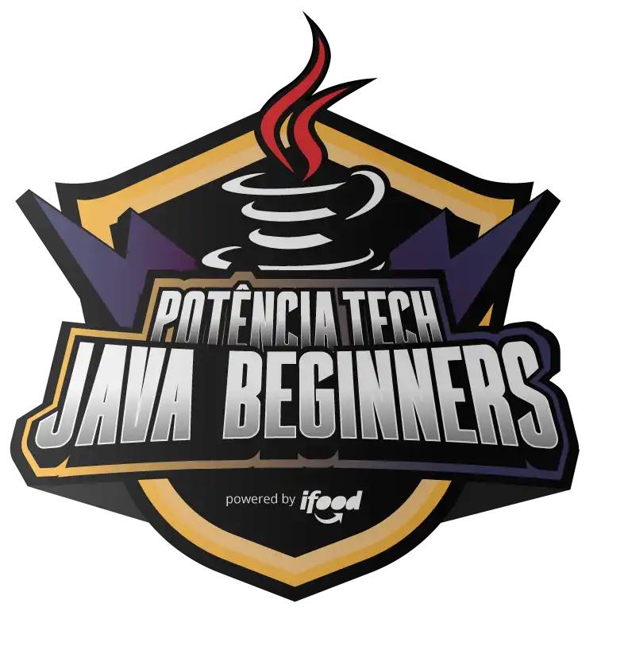

<h1>

Bootcamp Potência Tech powered by iFood   Java Beginners</h1>

<h3> Andamento do Processo:</h3>

## #1 Prepare-se para a Jornada

  - [x] Boas-vindas ao Potência Tech powered by iFood - Java Beginners

  - [x] Conheça as Oportunidades da DIO

  - [x] Seja Protagonista Neste Bootcamp

  - [x] ntrodução ao Desenvolvimento Moderno de Software

  - [x] Potência Tech powered by iFood - Java Beginners | Aula Inaugural

   

## #2 Princípios de Desenvolvimento de Software

  - [x] Introdução à Programação e Pensamento Computacional

  - [x] Introdução ao Git e ao GitHub

  - [x] Como Entregar seu Desafio de Projeto

  - [x] Criando seu Primeiro Repositório no GitHub Para Compartilhar Seu Progresso

   

## #3 Conhendo a Linguagem de Programação Java

  - [x] Introdução à Plataforma Java

  - [x] Ambiente de Desenvolvimento Java

  - [x]  Aprendendo a Sintaxe Java

  - [x] Lógica Condicional e Controle de Fluxos em Java
  
  - [x] Estruturas de Repetição e Arrays em Java
  
  - [x] Entendendo Métodos Java

  

## #4 Dominando Algoritmos Básicos com Desafios de Código Java

  - [x] Desafio: Os números são iguais?

  - [x] Desafio: Somando múltiplos.

  - [x]  Desafio: Uma chamada recursiva.

  - [x] Desafio: FizzBuzz.
  
  - [x] Desafio: Busca Sequencial.
  
  #### [Clique aqui para acessar TODOS os Desafios do Módulo 4](https://github.com/Adriano-Lima/Bootcamp-Potencia-Tech-powered-by-iFood/tree/main/Desafios-de-c%C3%B3digo/4-Dominando%20Algoritmos%20B%C3%A1sicos%20com%20Desafios%20de%20C%C3%B3digo%20Java)

  

## #5 Programação Orientada a Objetos com Java

  - [x] Programação Orientada a Objetos

  - [x] Trabalhando com Colletions Java

  - [x]  Debugging Java

  - [x] Tratamento de Exceções em Java
  
  - [x] Abstraindo um Bootcamp Usando Orientação a Objetos em Java

  

## #6 Ganhando Produtividade com Spring Framework

  - [x] Principais Protocolos de Comunicação da Internet

  - [x] Gerenciamento de Dependências e Build em Java com Maven

  - [x]  Imersão no Spring Framework com Spring Boot

  - [x] Criando uma API REST Documentada com Spring Web e Swagger
  
  - [x] Explorando Padrões de Projetos na Prática com Java

  

## #7 Dominando Algoritmos Intermediários com Desafios de Código Java

  - [x] Desafio: Checagem de Palíndromo

  - [x] Desafio: Validação de Parênteses

  - [x]  Desafio: Quadrados Perfeitos

  - [x] Desafio: Classificando Matrizes
  
  - [x] Desafio: Fatorial Desajeitado

#### [Clique aqui para acessar TODOS os Desafios do Módulo 7](https://github.com/Adriano-Lima/Bootcamp-Potencia-Tech-powered-by-iFood/tree/main/Desafios-de-c%C3%B3digo/7-Dominando%20Algoritmos%20Intermedi%C3%A1rios%20com%20Desafios%20de%20C%C3%B3digo%20Java)

  

## #8 Fortalecendo sua Carreira Profissional

  - [x] Deixando Seu LinkedIn Atrativo

  - [x] Turbine Seu Currículo na DIO

  - [x] Trabalhando em Equipes Ágeis

  - [x] Transformando seu Conhecimento em Artigos Técnicos
  
  - [x] Se Preparando Para Uma Entrevista
  
  - [x] Convite para o Minha Carreira Tech | Potência Tech powered by iFood

  

### _#BootcampIFoodJavaTech_

### _#ContratoDeCompromisso_

   

